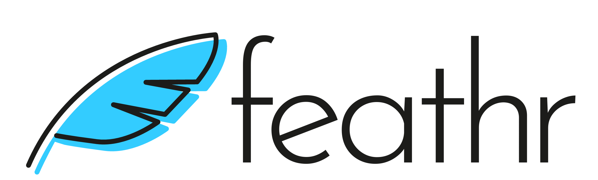
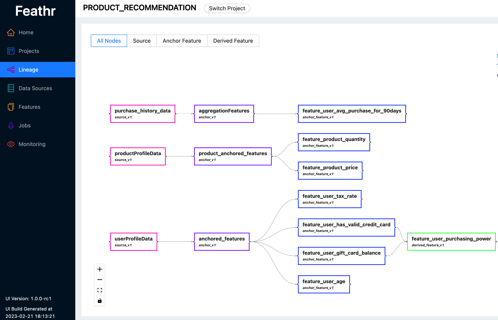
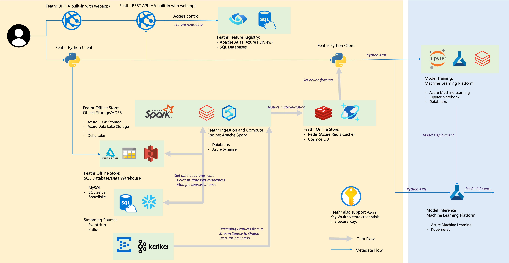

<html>
    <h1 align="center">
      
    </h1>
    <h3 align="center">
      A scalable, unified data and AI engineering platform for enterprise
    </h3>
    <h3 align="center">
      Important Links:
      <a href="https://join.slack.com/t/feathrai/shared_invite/zt-1ffva5u6v-voq0Us7bbKAw873cEzHOSg">Slack</a> &
      <a href="https://github.com/feathr-ai/feathr/discussions">Discussions</a>.
      <a href="https://feathr-ai.github.io/feathr/">Docs</a>.
    </h3>
</html>

[](https://github.com/feathr-ai/feathr/blob/main/LICENSE)
[](https://github.com/feathr-ai/feathr/releases)
[](https://feathr-ai.github.io/feathr/)
[](https://feathr.readthedocs.io/en/latest/)
[](https://bestpractices.coreinfrastructure.org/projects/6457)

## What is Feathr?

Feathr is a data and AI engineering platform that is widely used in production at LinkedIn for many years and was open sourced in 2022. It is currently a project under [LF AI & Data Foundation](https://lfaidata.foundation/blog/2022/09/12/feathr-joins-lf-ai-data-as-new-sandbox-project/).
 
Read our announcement on [Open Sourcing Feathr](https://engineering.linkedin.com/blog/2022/open-sourcing-feathr---linkedin-s-feature-store-for-productive-m) and [Feathr on Azure](https://azure.microsoft.com/en-us/blog/feathr-linkedin-s-feature-store-is-now-available-on-azure/), as well as the [announcement from LF AI & Data Foundation](https://lfaidata.foundation/blog/2022/09/12/feathr-joins-lf-ai-data-as-new-sandbox-project/).
 
Feathr lets you:
- **Define**  data and feature transformations based on raw data sources (batch and streaming) using Pythonic APIs.
- **Register**  transformations by names and get transformed data(features) for various use cases including AI modeling, compliance, go-to-market and more.
- **Share**  transformations and data(features) across team and company.

Feathr is particularly useful in AI modeling where it automatically computes your feature transformations and joins them to your training data, using point-in-time-correct semantics to avoid data leakage, and supports materializing and deploying your features for use online in production.

## 🌟 Feathr Highlights

- Native cloud integration with simplified and scalable architecture.
- Battle tested in production for more than 6 years: LinkedIn has been using Feathr in production for over 6 years and backed by a dedicated team.
- Scalable with built-in optimizations: Feathr can process billions of rows and PB scale data with built-in optimizations such as bloom filters and salted joins.
- Rich transformation APIs including time-based aggregations, sliding window joins, look-up features, all with point-in-time correctness for AI.
- Pythonic APIs and highly customizable user-defined functions (UDFs) with native PySpark and Spark SQL support to lower the learning curve for all data scientists.
- Unified data transformation API works in offline batch, streaming, and online environments.
- Feathr’s built-in registry makes named transformations and data/feature reuse a breeze.


## 🛠️ Install Feathr Client Locally

1. Only Feathr Client 

create env & activate it 
```
- conda create -n feathr39 python=3.9
- conda activate feathr39 
```

If you want to install Feathr client in a python environment, use this:

VNPT Team [hightly recommend that] use vnpt github instead of base project.
+ I fix a lot of bugs for python project.
+ We will maintain this project with updated features which can be comparable with version of Feathr on azure

```bash
pip install git+https://github.com/vnpt-ds-core/feathr_deploy.git#subdirectory=feathr_project
```

install more packages if we need
```
- python -m pip install --user interpret==0.2.7
- python -m pip install jupyterlab
```

2. Plus Register Server: FeathrUI

+ setup .env 

```
# postgres
POSTGRES_USER=*****
POSTGRES_PASSWORD=*****
HOST_POSTGRES_PORT=*****
HOST_POSTGRES_DATA_DIR=*****
```
+ run register sql docker
```
docker compose -f docker-compose-ui.yml up -d
```

  result: 

```
Using API BASE:  /api/v1
INFO:     Started server process [1798]
INFO:     Waiting for application startup.
INFO:     Application startup complete.
INFO:     Uvicorn running on http://0.0.0.0:8000 (Press CTRL+C to quit)
```

3. build Scala core 

- request admin (bambootran89) for jar file, this branch is not allowed to build

4. start redis

- first stop: sudo systemctl stop redis
- check: sudo lsof -i :6379
- redis-server --requirepass foobared

5. enjoy the setup:  

-  pip install jupyterlab
-  FEATHR_SANDBOX=True jupyter lab
   
   NOTE: off security bey on FEATHR_SANDBOX=True mode

-Then: We go to dir of docs/samples to see a lot example to start. we can use jupyterlab to run all samples.

NOTE: copy vnpt_feathr-{version}.jar in dir of build/libs to the dir of running docs/samples (just or easy start, we can config path in the future) 

## ☁️ Running Feathr on Cloud for Production

Feathr has native integrations with Databricks and Azure Synapse:

Follow the [Feathr ARM deployment guide](https://feathr-ai.github.io/feathr/how-to-guides/azure-deployment-arm.html) to run Feathr on Azure. This allows you to quickly get started with automated deployment using Azure Resource Manager template.

If you want to set up everything manually, you can checkout the [Feathr CLI deployment guide](https://feathr-ai.github.io/feathr/how-to-guides/azure-deployment-cli.html) to run Feathr on Azure. This allows you to understand what is going on and set up one resource at a time.

- Please read the [Quick Start Guide for Feathr on Databricks](./quickstart_databricks.md) to run Feathr with Databricks.
- Please read the [Quick Start Guide for Feathr on Azure Synapse](./quickstart_synapse.md) to run Feathr with Azure Synapse.

## 📓 Documentation

- For more details on Feathr, read our [documentation](https://feathr-ai.github.io/feathr/).
- For Python API references, read the [Python API Reference](https://feathr.readthedocs.io/).
- For technical talks on Feathr, see the [slides here](./talks/Feathr%20Feature%20Store%20Talk.pdf) and [here](./talks/Feathr%20Community%20Talk%20%E2%80%93%20An%20Enterprise-Grade%20High%20Performance%20Feature%20Store.pdf). The recording is [here](https://www.youtube.com/watch?v=gZg01UKQMTY).

## 🧪 Samples

| Name                                                                                | Description                                                                                                                           | Platform                               |
| ----------------------------------------------------------------------------------- | ------------------------------------------------------------------------------------------------------------------------------------- | -------------------------------------- |
| [NYC Taxi Demo](./samples/nyc_taxi_demo.ipynb)                                      | Quickstart notebook that showcases how to define, materialize, and register features with NYC taxi-fare prediction sample data.       | Azure Synapse, Databricks, Local Spark |
| [Databricks Quickstart NYC Taxi Demo](./samples/nyc_taxi_demo.ipynb)                | Quickstart Databricks notebook with NYC taxi-fare prediction sample data.                                                             | Databricks                             |
| [Feature Embedding](./samples/feature_embedding.ipynb)                              | Feathr UDF example showing how to define and use feature embedding with a pre-trained Transformer model and hotel review sample data. | Databricks                             |
| [Fraud Detection Demo](./samples/fraud_detection_demo.ipynb)                        | An example to demonstrate Feature Store using multiple data sources such as user account and transaction data.                        | Azure Synapse, Databricks, Local Spark |
| [Product Recommendation Demo](./samples/product_recommendation_demo_advanced.ipynb) | Feathr Feature Store example notebook with a product recommendation scenario                                                          | Azure Synapse, Databricks, Local Spark |


## 🔡 Feathr Highlighted Capabilities

Please read [Feathr Full Capabilities](./concepts/feathr-capabilities.md) for more examples. Below are a few selected ones:

### Feathr UI

Feathr provides an intuitive UI so you can search and explore all the available features and their corresponding lineages.

You can use Feathr UI to search features, identify data sources, track feature lineages and manage access controls. Check out the latest live demo [here](https://aka.ms/feathrdemo) to see what Feathr UI can do for you. Use one of following accounts when you are prompted to login:

- A work or school organization account, includes Office 365 subscribers.
- Microsoft personal account, this means an account can access to Skype, Outlook.com, OneDrive, and Xbox LIVE.



For more information on the Feathr UI and the registry behind it, please refer to [Feathr Feature Registry](./concepts/feature-registry.md)

### Rich UDF Support

Feathr has highly customizable UDFs with native PySpark and Spark SQL integration to lower learning curve for data scientists:

```python
def add_new_dropoff_and_fare_amount_column(df: DataFrame):
    df = df.withColumn("f_day_of_week", dayofweek("lpep_dropoff_datetime"))
    df = df.withColumn("fare_amount_cents", df.fare_amount.cast('double') * 100)
    return df

batch_source = HdfsSource(name="nycTaxiBatchSource",
                        path="abfss://feathrazuretest3fs@feathrazuretest3storage.dfs.core.windows.net/demo_data/green_tripdata_2020-04.csv",
                        preprocessing=add_new_dropoff_and_fare_amount_column,
                        event_timestamp_column="new_lpep_dropoff_datetime",
                        timestamp_format="yyyy-MM-dd HH:mm:ss")
```

### Defining Window Aggregation Features with Point-in-time correctness

```python
agg_features = [Feature(name="f_location_avg_fare",
                        key=location_id,                          # Query/join key of the feature(group)
                        feature_type=FLOAT,
                        transform=WindowAggTransformation(        # Window Aggregation transformation
                            agg_expr="cast_float(fare_amount)",
                            agg_func="AVG",                       # Apply average aggregation over the window
                            window="90d")),                       # Over a 90-day window
                ]

agg_anchor = FeatureAnchor(name="aggregationFeatures",
                           source=batch_source,
                           features=agg_features)
```

### Define Features on Top of Other Features - Derived Features

```python
# Compute a new feature(a.k.a. derived feature) on top of an existing feature
derived_feature = DerivedFeature(name="f_trip_time_distance",
                                 feature_type=FLOAT,
                                 key=trip_key,
                                 input_features=[f_trip_distance, f_trip_time_duration],
                                 transform="f_trip_distance * f_trip_time_duration")

# Another example to compute embedding similarity
user_embedding = Feature(name="user_embedding", feature_type=DENSE_VECTOR, key=user_key)
item_embedding = Feature(name="item_embedding", feature_type=DENSE_VECTOR, key=item_key)

user_item_similarity = DerivedFeature(name="user_item_similarity",
                                      feature_type=FLOAT,
                                      key=[user_key, item_key],
                                      input_features=[user_embedding, item_embedding],
                                      transform="cosine_similarity(user_embedding, item_embedding)")
```

### Define Streaming Features

Read the [Streaming Source Ingestion Guide](https://feathr-ai.github.io/feathr/how-to-guides/streaming-source-ingestion.html) for more details.

### Point in Time Joins

Read [Point-in-time Correctness and Point-in-time Join in Feathr](https://feathr-ai.github.io/feathr/concepts/point-in-time-join.html) for more details.

### Running Feathr Examples

Follow the [quick start Jupyter Notebook](https://github.com/feathr-ai/feathr/blob/main/docs/samples/azure_synapse/product_recommendation_demo.ipynb) to try it out. There is also a companion [quick start guide](https://feathr-ai.github.io/feathr/quickstart_synapse.html) containing a bit more explanation on the notebook.

## 🗣️ Tech Talks on Feathr

- [Introduction to Feathr - Beginner's guide](https://www.youtube.com/watch?v=gZg01UKQMTY)
- [Document Intelligence using Azure Feature Store (Feathr) and SynapseML](https://mybuild.microsoft.com/en-US/sessions/5bdff7d5-23e6-4f0d-9175-da8325d05c2a?source=sessions)
- [Notebook tutorial: Build a Product Recommendation Machine Learning Model with Feathr Feature Store](https://www.youtube.com/watch?v=2KSM-NLfvY0)
- [Feathr talk in Feature Store Summit](https://www.youtube.com/watch?v=u8nLY9Savxk)

## ⚙️ Cloud Integrations and Architecture



| Feathr component                | Cloud Integrations                                                                                                                   |
| ------------------------------- |--------------------------------------------------------------------------------------------------------------------------------------|
| Offline store – Object Store    | Azure Blob Storage, Azure ADLS Gen2, AWS S3, Minio (S3)                                                                                          |
| Offline store – SQL             | Azure SQL DB, Azure Synapse Dedicated SQL Pools, Azure SQL in VM, Snowflake, JDB (MySQL, Postgres)                                                          |
| Offline store – NoSQL             | MongoDb
| Streaming Source                | Kafka, EventHub                                                                                                                      |
| Online store                    | Redis, [Azure Cosmos DB](https://feathr-ai.github.io/feathr/how-to-guides/jdbc-cosmos-notes.html#using-cosmosdb-as-the-online-store), will support MongoDb |
| Feature Registry and Governance | Azure Purview, ANSI SQL such as Azure SQL Server                                                                                     |
| Compute Engine                  | Azure Synapse Spark Pools, Databricks, Local Spark                                                                                                |
| Machine Learning Platform       | Azure Machine Learning, Jupyter Notebook, Databricks Notebook                                                                        |
| File Format                     | Parquet, ORC, Avro, JSON, Delta Lake, CSV                                                                                            |
| Credentials                     | Azure Key Vault                                                                                                                      |

## 🚀 Roadmap

- [ ] More Feathr online client libraries such as Java
- [ ] Support feature versioning
- [ ] Support feature monitoring

## 👨‍👨‍👦‍👦 Community Guidelines

Build for the community and build by the community. Check out [Community Guidelines](../CONTRIBUTING.md).

## 📢 Slack Channel

Join our [Slack channel](https://feathrai.slack.com) for questions and discussions (or click the [invitation link](https://join.slack.com/t/feathrai/shared_invite/zt-1ffva5u6v-voq0Us7bbKAw873cEzHOSg)).
